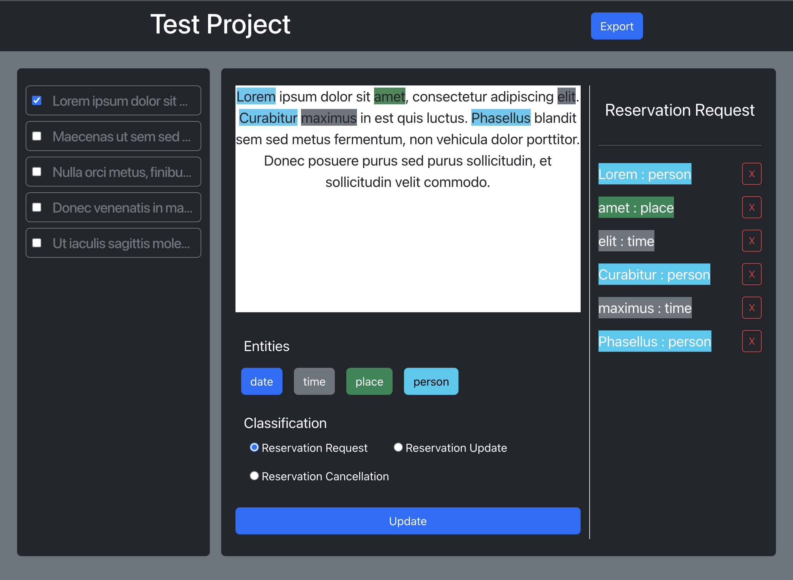
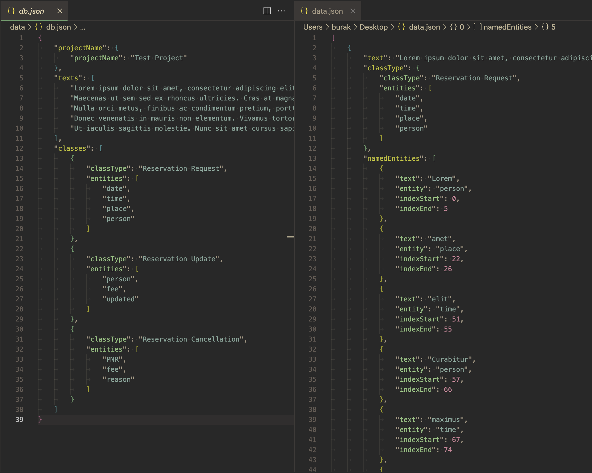

# EntityForge

EntityForge is a sophisticated text classification and named entity labeling tool designed to streamline data annotation tasks. With EntityForge, users can effortlessly classify text data and label named entities within JSON files, empowering them to efficiently process and analyze textual data.



## Features

- **JSON Input:** Import JSON files containing text data for annotation, along with classes and entities from `db.json`.
- **Text Classification:** Classify text data into predefined categories or labels.
- **Named Entity Labeling:** Identify and label named entities within text documents.
- **Export Functionality:** Export annotated data in JSON format as `data.json` for seamless integration with other systems or further analysis.

## Requirements

Before starting :checkered_flag:, you need to have [Git](https://git-scm.com) and [Node](https://nodejs.org/en/) installed.

## :checkered_flag: Starting ##

```bash
# Clone this project
$ git clone https://github.com/{{YOUR_GITHUB_USERNAME}}/EntityForge.git

# Access
$ cd EntityForge

# Install dependencies
$ npm install

# Run the server for your input
$ npx json-server --watch data/db.json --port 8000

# Run the application
$ npm start

# Access EntityForge through your web browser at `http://localhost:3000`
```

## Usage

1. **Data Import:** Upload JSON files containing text data into EntityForge, along with classes and entities imported from `db.json`.
2. **Text Annotation:** Utilize the intuitive interface to classify text data and label named entities.
3. **Export Results:** Export annotated data in JSON format for seamless integration with other applications or systems.



## Input Configuration (db.json)

The `db.json` file should contain the classes and entities required for text annotation. Ensure that it is correctly formatted and up-to-date with your classification and entity labeling requirements.

## Contributing

Contributions to EntityForge are highly appreciated! To contribute:

1. Fork the repository.
2. Create a new branch for your feature or bug fix.
3. Implement your changes and commit them with descriptive messages.
4. Push your changes to your fork.
5. Submit a pull request to the main repository.

## License

EntityForge is licensed under the [MIT License](LICENSE).

## Contact

For any inquiries or feedback, please reach out to [cakirburak43@gmail.com](mailto:your_email@example.com).
